## 工具栏（toolbar）
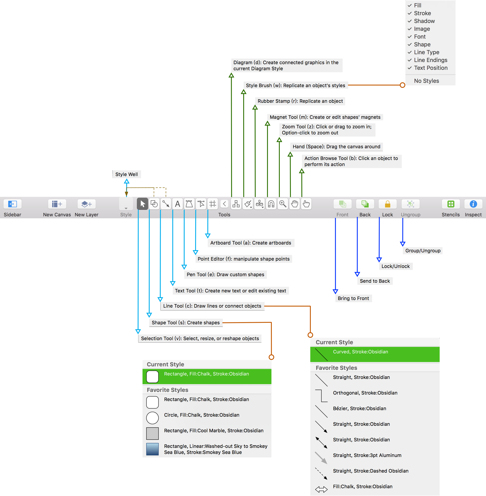

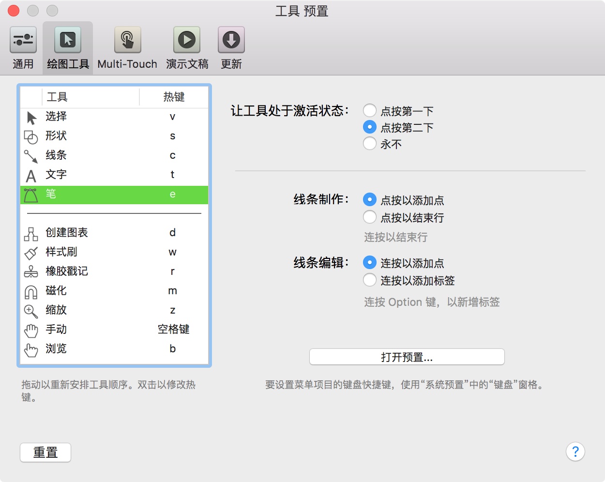

## 显示
`⌥⌘1`：显示/隐藏**左侧工具条**  
`⌘` `[` / `]`：上/下一版面  
<kdb>⌘</kbd> <kbd>\\</kbd>：显示/隐藏网格线  
`⌘` `R`：显示/隐藏标尺  

## 检查器
`⇧⌘I`:显示/隐藏**右侧检查器**  

`F3`：检查器悬浮  
`F2`：检查器停靠右侧  
`⌘1`：显示/隐藏对象1

### 对象（⌘1）
#### 填充（Fill）
背景填充
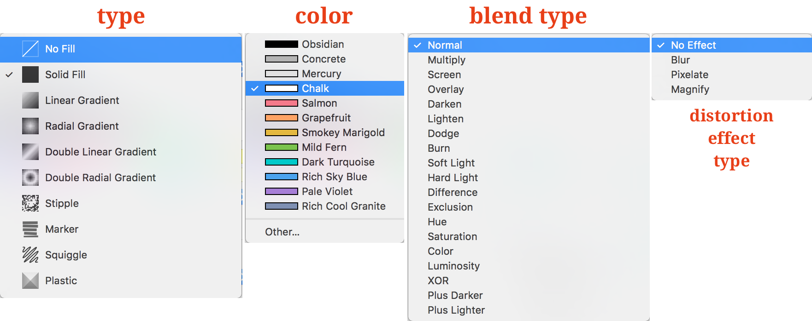

#### 笔划（Stroke）

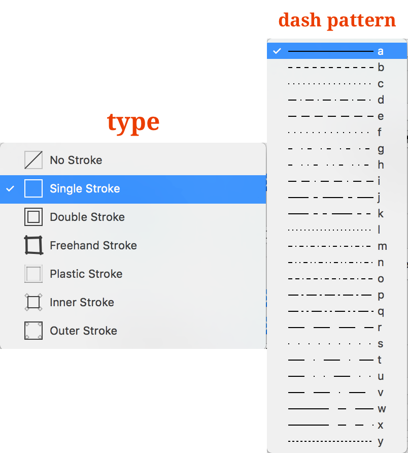

- 无描边：没有边框线  
- **单笔划**：参考点正中绘制边框线条  
- 双笔划：双线条边框  
- 手绘笔划：偏向手绘线感  
- 内部笔划：参考点内部绘制边框线条  
- 外部笔划：参考点外部部绘制边框线条  

可设置线条颜色（默认黑色）、线宽点数（默认1）、线条型态（默认实线）。

#### 阴影（Shadow）

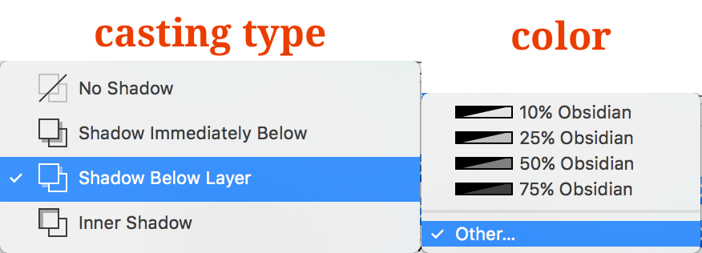

- 无阴影  
- 立即在下方加上阴影  
- **图层下的阴影**  
- 内部阴影  

可设置阴影线宽点数、横纵偏移、

#### 形状（Shape）
可更改选定图形的形状。

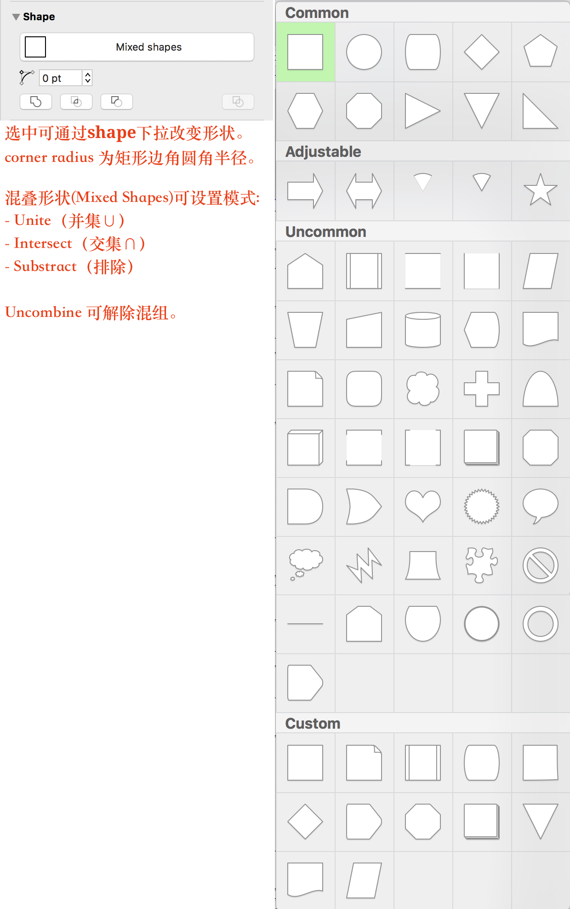

#### 线条（Line）

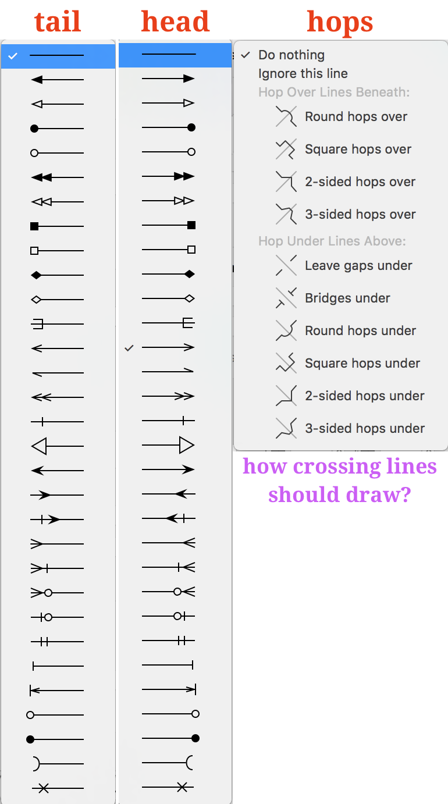

#### 图像（Image）
设置图形的背景图像（background image）。  
可设置背景图像的横纵偏移和宽高比例。结合形状可设置圆形头像。  

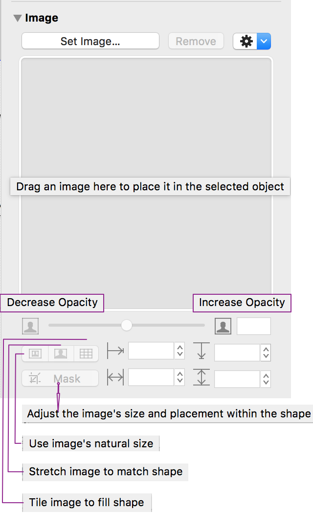

#### 几何形状（Geometry）

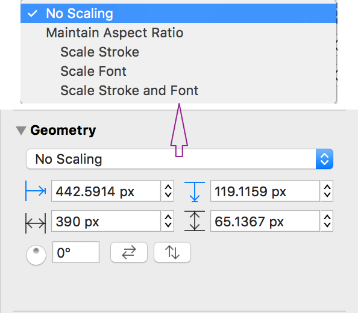

缩放比例：

- 无缩放比例  
- 保持宽高比(缩放笔划、缩放字体、笔划和字体缩放)  

坐标位置、宽高。

### 类型（⌘2）
#### 字体（Font）

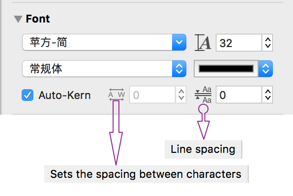

字体、颜色、大小、粗斜。

「格式|字体」：

1. 粗体、细体、下划线、空心字  
2. 基线：默认、上标、下标、升高、降低  
3. 字距：默认、不适用、紧排、松排  

#### 文字（Text Position）

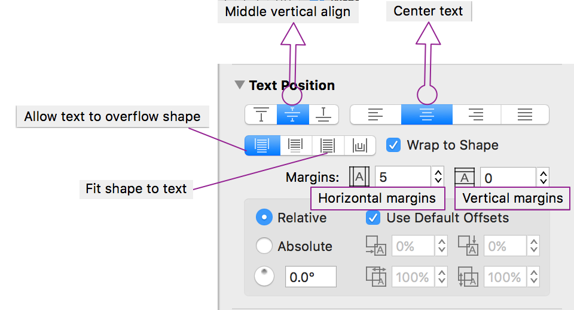

**横向**对齐：左、居中、右、两边  
**纵向**对齐：顶部、居中、底部  

可设置文本框与形状的边距（EdgeInsets）。  
可设置形状高度随文字高度，形状和文本框同框；此时可设置纵向边距。

#### 偏移量
使用预设偏移量；  
可设置文本框相对形状顺时针旋转度数。

### 属性（⌘3）
#### 连接
属性|连接|线条.todo

- [x] 允许从行连接  
- [x] 允许连接到其他对象  
- [x] 允许将形状制成标签  
- [ ] 依对象中心布线  

「连接」面板的线路设置中，如果去掉「允许自动连接」和「允许连接到其他对象」的勾选，那么线条就会由「连接线」变成普通的线条。

作为连接线使用时，按住「option」键可以强制移动连接点不自动连接到对象或磁化点。

作为连接线时，在线条上双击可**添加编辑点**；按「option」键双击则可添加**线条标签**。

#### 附注
为图形对象添加附注。

#### 动作
为图形添加动作：

- 无任何操作  
- 打开一个URL  
- 打开文件  
- 运行脚本  
- **跳到别处**（切换到特定版面）  
- **显示或隐藏图层**（显示、隐藏或切换）  

### 版面（⌘4）
#### 大小
版面|大小.todo

- [x] 自动调整版面大小  
- [x] 大小采用打印机页面  
- [ ] 在一页上打印版面  

**版面数量**

- 版面数量：可设置横向和纵向版数。  
- 打印方向：使用页面设置、竖排、横排。  
- 100%缩放：

	- 一个屏幕像素（Pixel）  
	- 一个Apple点（Point）  
	- 一个PostScript点  

#### 填充
填充整个版面的背景色

#### 图像
设置整个版面的背景图像（background image）。  
可设置背景图像的横纵偏移和宽高比例。  

#### 单元
`像素(px)` 或 `点(pt)*`

比例：1 点(matrix point) = 1 像素  
原点：默认(0，0)。

#### 网格
主网格间距  
副网格格数  

显示格线.todo

- [x] 显示格线  
- [x] 显示主网格  

#### 图表布局
千万不要勾选【自动编排】！

### 文稿（⌘5）
#### 格式
存储为 flat 文件  
默认 于磁盘中压缩。

#### 边距
使用打印机页边空白

#### 文档数据
主题、版权、版本、说明

可为当前版面添加附注。

### 型版（⌘6）
- 地图
- 常用

## 编辑
### 大纲
`⌥⌘;`：添加父项
`⌘}`：添加子项
`⌘{`：添加叔母项
`⌥⌘'`：添加兄弟项
`⌥⌘/`：添加配偶项

### 无鼠标编辑

### 磁化物
位置：可以选择每边几个磁极。可在【显示】中查看磁化物（点）。

### 可编辑
编辑|形状：使点可编辑

### 旋转
选中图形，按下⌘键，在参考点附近将出现可旋转标记。此时，三指移动即可实现旋转。

在 「检查器|对象|几何形状」 中也可以设定旋转角度。

## 格式
【拷贝样式】（⌥⌘C）
【粘贴样式】（⌥⌘V）

将检查器底栏的「样式托盘」中的样式拖拽到对象上应用。

### 字体

### 文字
对齐

## 排列
`⌥⌘F`：前移
`⇧⌘F`：移到最前

`⌥⌘B`：后移
`⇧⌘B`：移到最后

## 文件
`⌥⌘P`：演示文稿
`⌥⌘E`：导出
