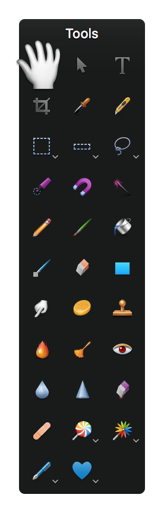

## Edit
### Rotate
在 「Edit」菜单中可以选中图层进行 Rotate 180°、90° Right、90° Left。

- 180°、90° Right、90° Left  
- Flip Vertical：垂直翻转  
- Flip Horizontal：水平翻转  

点击 「Edit | **Transform**」菜单或者右键快捷菜单，进入 transform 模式，可进行等比拉伸。双击退出 transform 模式。

选中图形，按下 ⌘ 键，在参考点附近将出现**可旋转**标记。此时，三指移动即可实现旋转。同 OmniGraffle。

### Select Color
放大镜选择指定色块的颜色值(RGB)。
相当于工具栏中的滴管(Eyedropper Tool)。

## Image
### Color Adjustments
相当于[View|Show Effects]

### Canvas
#### Trim Canvas：修剪画布
#### Reveal Canvas：展示画布
#### Rotate Canvas：旋转画布
- 180°、90° Right、90° Left  
- Flip Vertical：垂直翻转  
- Flip Horizontal：水平翻转  

#### Canvas Size（⌥⌘C）：画布尺寸
扩大画布范围，可指定扩展方向，方便拼图。

#### Image Size（⌥⌘I）：图像尺寸
图像像素将会等比例缩放。

#### Color Depth：8/16-bits per channel
#### Color Profile：颜色定制？？？

## View
### Zoom
1. 显示实际100%尺寸（Actual Size）：⌥⌘0
2. 自动缩放以适应窗口大小（Zoom to Fit）：⌘0
3. 缩放（Zoom In/Zoom Out）：⌘+/⌘-

### Rulers/Grid
1. 显示/隐藏坐标标尺（Show Rulers）：⌘R
2. 显示/隐藏坐标网格（Show Grid）：⌥⌘'
3. 显示信息栏（Show/Hide Info Bar）：显示光标像素点的RGB、XY坐标信息。
	双击或右击可以选择显示的选项。

### Guides
1. Show Guides at Object Center  
2. Show Guides at Object Edges  
3. Show Relative Spacing  
4. Show Relative Sizes  

当拖动不同的 layers 时，会自动显示相对相邻图层对象或画布的中心（Center）及边缘（Edges）对齐参考线。  

### Tools
Pixelmator 主界面从上到下的元素依次是：

1. 菜单  
2. 标题栏  
3. 标签栏（Tab Bar）  
4. 工具栏（Tool Options）  
5. 信息栏（Info Bar）  

#### 工具箱
显示/隐藏工具箱（Show/Hide Tools）：⌘1  

View | Show Shapes：打开工具箱中的 Custom Shape Tool。

- Hand Tool(H)：阅读模式  
- Move Tool(V)：选择移动模式（可选中图层对象进行拖移）  
- Type Tool(T)：输入模式（点击添加文本框对象）  
- Crop Tool(C)：裁剪模式  
- Rectangular Marquee Tool(M)：矩形选择模式  

#### 工具栏选项
显示/隐藏工具栏选项（Show/Hide Tool Options）：⌥⌘T  

工具栏是 Styles 信息显示和设置入口。

##### Picture
对于 Picture 对象，包括：

- Opacity（透明度）：0~100%  
- Shadow（阴影）：包括 Shadow 和 Inner Shadow  
- Reflection（反射）  

##### Shape
对于 Shape 对象，包括：

- Fill（填充）：可选 None、Color 或 Gradient。  
- Stroke（边框轮廓）：可选 None、Color 或 Gradient；另外可设置 Width（线宽粗细）。  
- Mode（图层模式），默认为叠加  
- Style：可设置Inside、Center或Outside，以及线型（虚线或实线类型）  

##### Text
对于 Text 对象，工具栏中的 T（Type Tool）添加文本框，右键可设置格式（Underline、Strikethrough、Outline）。  

设置字体、字号、颜色后，可以设置横向和纵向对齐。  
还可以设置纵向和横向的压缩比例，使得文字间隔宽松或收紧。 

对于文本框，右键快捷菜单 Baseline 可设置基线：

- 默认（Default）  
- 上标（Superscript）  
- 下标（Subscript）  
- 升高（Raise）  
- 降低（Lower）  

工具栏选项中的 ·T·（Add Text）添加大纲（Outline），类似于水印蒙层。 

#### 信息栏
Show/Hide Info Bar：显示/隐藏 信息栏

- RGB 信息：显示当前光标所在像素色块颜色值（RGB Color Values）  
- XY 信息：显示当前光标所在像素的横X（西向东）纵Y（北向南）坐标信息（Curson Coordinates）  
- WH 信息：显示当前选中图层对象的宽高信息（Dimensions）  
- △X/△Y：拖移时显示位移（Position Change）  
- °X/°Y：相对画布原点的起点坐标（Starting Position Coordinates）  

### Show
1. Layers：⌘2  
2. Effects：⌘3，相当于[Image|Color Adjustments]  
3. Styles：⌘7  
4. Brushes：⌘4  
5. Gradients：⌘5  
7. Show/Hide Photo Browser：⌘6  
8. Fonts：⌘T  
9. Colors：⇧⌘C  
10. Enter FullScreen：^⌘F  

## Slice
[Basics of Slicing with Pixelmator](http://abduzeedo.com/basics-slicing-pixelmator)

After you have created all of the slices and named them properly, go through the layer palette hiding layers that are not necessary: all of the text and the background. As I mentioned before, the background slice will have to be exported again later on with the background active.

With all the adjustments done, click on **Export for Web** in the Slice Tool Option. A dialog box will open asking where you want to save the slices. Create a new folder on your computer called “Site”; inside this folder, create another folder called “imgs.” Select the imgs folder and export all of the images into it.