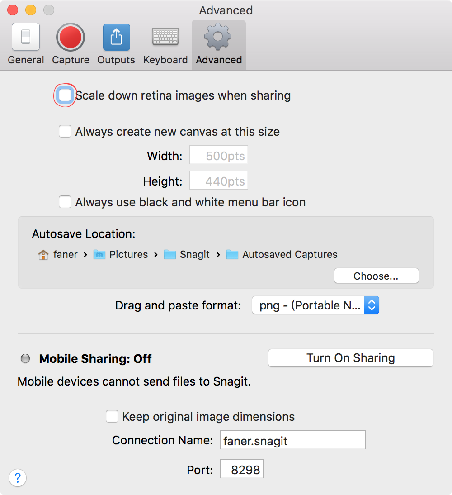
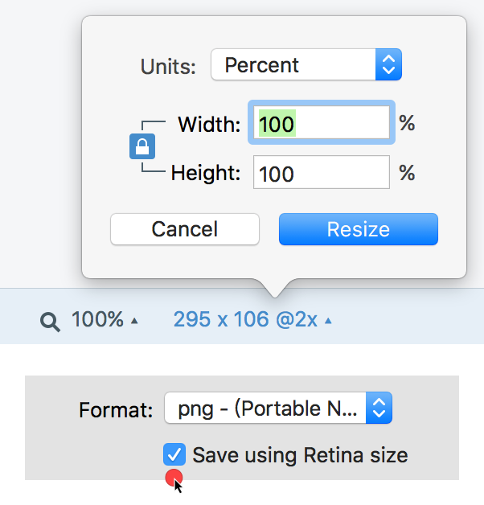
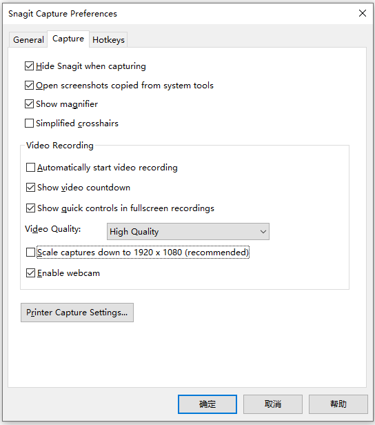
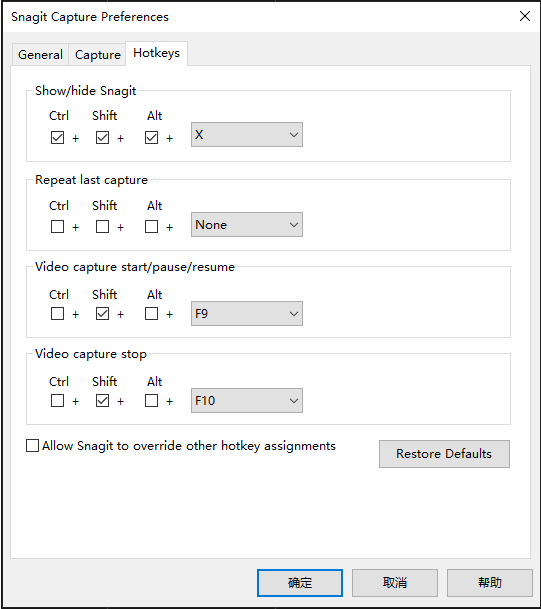
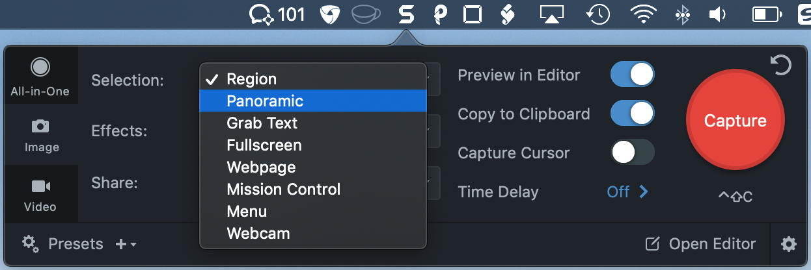
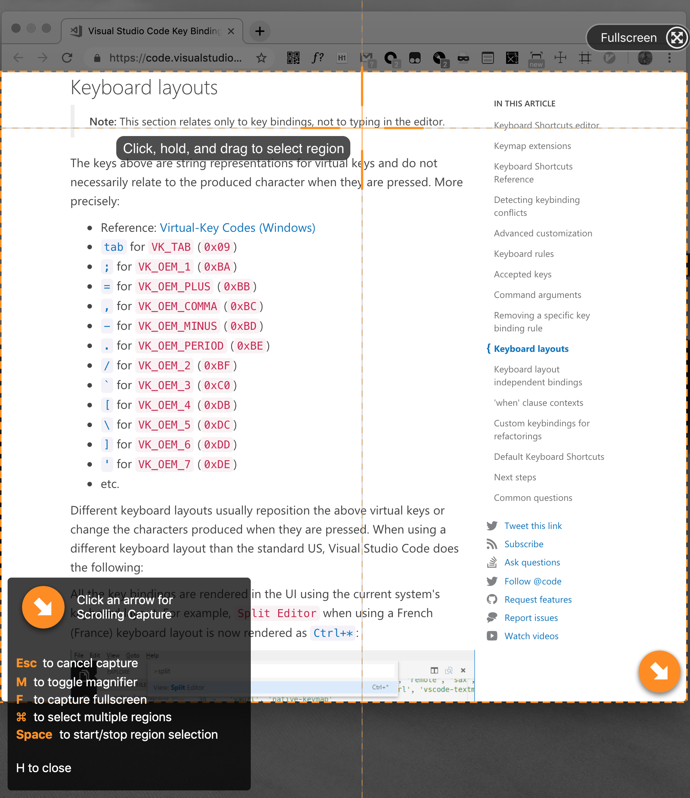
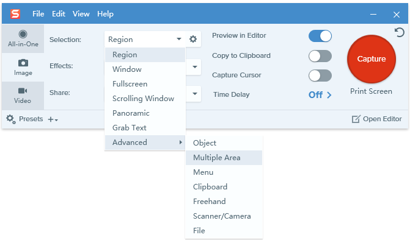

# SnagIt

<https://www.techsmith.com>

截图、录屏、标注

## [终极截屏工具](http://www.snagit.com.cn/index.htm)

Snagit 为您提供所有必需工具来创建抢眼的图像和视频，并帮助您轻松简便地进行共享。
对 Snagit 进行定制来使其满足您的特定需求或您整个企业的需求。

## [Recapture Your Day with Snagit](https://www.techsmith.com/snagit.html)

Create remarkable visuals.  
Reduce wasted time.  
Share important information.  

## Why Snagit Screen Capture?

Visuals help clarify your message and get you hours back in your work day. Snagit is the premium tool for screen capture and screen recording on Windows and Mac. Combining traditional screenshots, videos, and image editing to help you share important information with the people who need it most.

## Features

### Quickly capture images and videos of your screen.

Snagit’s image and video capture is powerful, but not complex. You’re in control of everything you capture, right down to the pixel. All-in-One Capture® grabs your entire desktop, a region, a window, or a scrolling window from any webpage or application—all with a single hotkey or click.

- Scrolling capture

> Quickly capture a full-page screenshot even if it's not showing on the screen. Grab the horizontal, vertical, or entire scrolling area with just a click.

- Panoramic capture

> Capture wide, horizontal scrolls, infinitely scrolling webpages, and everything in between. Capture once, instead of taking individual captures and manually editing them together.

### Get your point across. Mark up your screenshots.

Showing team members is a lot easier than telling them. Snagit has a dynamic editor that lets you turn plain screenshots or screengrabs into clear, concise communication. Comment over screenshots using text boxes. Point out your ideas with arrows and shapes. Or simply highlight key areas. And Snagit's toolbar is completely customizable so all of your favorite tools stay front and center.

## Preferences

macOS:

Save using Retina size:

Windows:

Windows 下采用 `ctrl+shift+alt+x` 作为 SnagIt 全局唤起快捷键：

## Usage

macOS 下的 `Panoramic` 模式支持滚动全景截屏。

按下 <kbd>⌘</kbd> 键支持多区域截图。

Windows 也可选择多区域截图（Multiple Area）截图模式：

